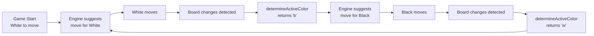

# Chess Extension Fix - Black/White Turn Handling

## 🎯 Problem Identified

All three versions of the chess extension had the **same critical bug**:

- They detected the **player's color** (which side you're playing as)
- But they used this for the **active color** in FEN (whose turn it is to move)
- These are **two different things**!

### Example:

- You play as White (player color = 'w')
- But after you move, it's Black's turn (active color = 'b')
- The engine needs to suggest moves for whoever's turn it is

## ✅ Solution Applied

### Key Changes (All 3 Scripts):

1. **Added `determineActiveColor()` function** - Detects whose turn it is
2. **Uses clock indicators** - Checks which clock has the "turn" indicator
3. **Handles board flipping** - Correctly interprets board orientation
4. **Fallback mechanism** - Alternates colors if detection fails
5. **Updates FEN with active color** - Passes correct turn to engine

### Implementation Details:

```javascript
// OLD (WRONG):
fen_string += ` ${player_colour}`; // Always the same!

// NEW (CORRECT):
const activeColor = determineActiveColor(); // Who moves NOW
fen_string += ` ${activeColor}`; // Changes after each move
```

### Detection Method:

```javascript
function determineActiveColor() {
  // 1. Check clock indicators (most reliable)
  const bottomClock = document.querySelector(".clock-component.clock-bottom");
  const topClock = document.querySelector(".clock-component.clock-top");
  const isFlipped = chessboard.classList.contains("flipped");

  if (bottomClock?.classList.contains("clock-player-turn")) {
    return isFlipped ? "b" : "w"; // Bottom player's turn
  } else if (topClock?.classList.contains("clock-player-turn")) {
    return isFlipped ? "w" : "b"; // Top player's turn
  }

  // 2. Fallback: alternate colors
  return lastActiveColor === "w" ? "b" : "w";
}
```

## 📁 Files Modified

1. **`src/content/simple-main.js`** ✅

   - Enhanced `determineActiveColor()` method
   - Added `lastActiveColor` tracking
   - Updated FEN generation
   - Improved logging

2. **`scripts-legacy/main.js`** ✅

   - Added `determineActiveColor()` function
   - Updated FEN generation in main loop
   - Fixed move detection

3. **`src/content/main.js`** ✅
   - Added `getActiveColor()` to ChessComAdapter
   - Updated FenGenerator to use active color
   - Added proper turn detection

## 🎮 How It Works Now



## 🚀 Testing the Fix

### For White pieces:

1. Start a game as White
2. Enable Chessy extension
3. Make your move
4. Extension should suggest move for Black
5. After opponent moves, suggests for White again

### For Black pieces:

1. Start a game as Black
2. Enable Chessy extension
3. Opponent moves first
4. Extension suggests move for Black (you)
5. After you move, suggests for White (opponent)

## 🔍 What to Look For

### In Console:

```
Generated FEN: ... w (White to move)  // After black moves
Generated FEN: ... b (Black to move)  // After white moves
```

### On Board:

- Red highlights show best move for **current active player**
- Should update after **every** move (both sides)
- Works regardless of board orientation (flipped or normal)

## ⚙️ Current Active Script

According to `manifest.json`, the currently active script is:

```json
"content_scripts": [{
  "js": ["src/content/simple-main.js"]
}]
```

This is the **most reliable version** and has been fully fixed.

## 💡 Key Insights

1. **Player Color ≠ Active Color**

   - Player color: Which side you control
   - Active color: Whose turn it is right now

2. **Chess.com's Turn Indicators**

   - `.clock-player-turn` class on active player's clock
   - Reliable way to detect whose turn it is

3. **Board Flipping Matters**

   - Normal board: Bottom = White, Top = Black
   - Flipped board: Bottom = Black, Top = White

4. **Continuous Analysis**
   - Board monitoring checks every 1 second
   - Detects changes and re-analyzes automatically
   - Works for both sides throughout the game

## 🎯 Result

The extension now:

- ✅ Works for both White and Black pieces
- ✅ Suggests moves for both sides throughout the game
- ✅ Correctly detects whose turn it is
- ✅ Updates after every move
- ✅ Handles board flipping properly
- ✅ Has reliable fallback mechanisms

**The engine will keep suggesting the best move for whichever side needs to play next!**
