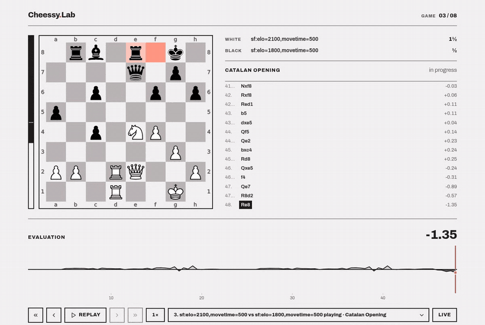
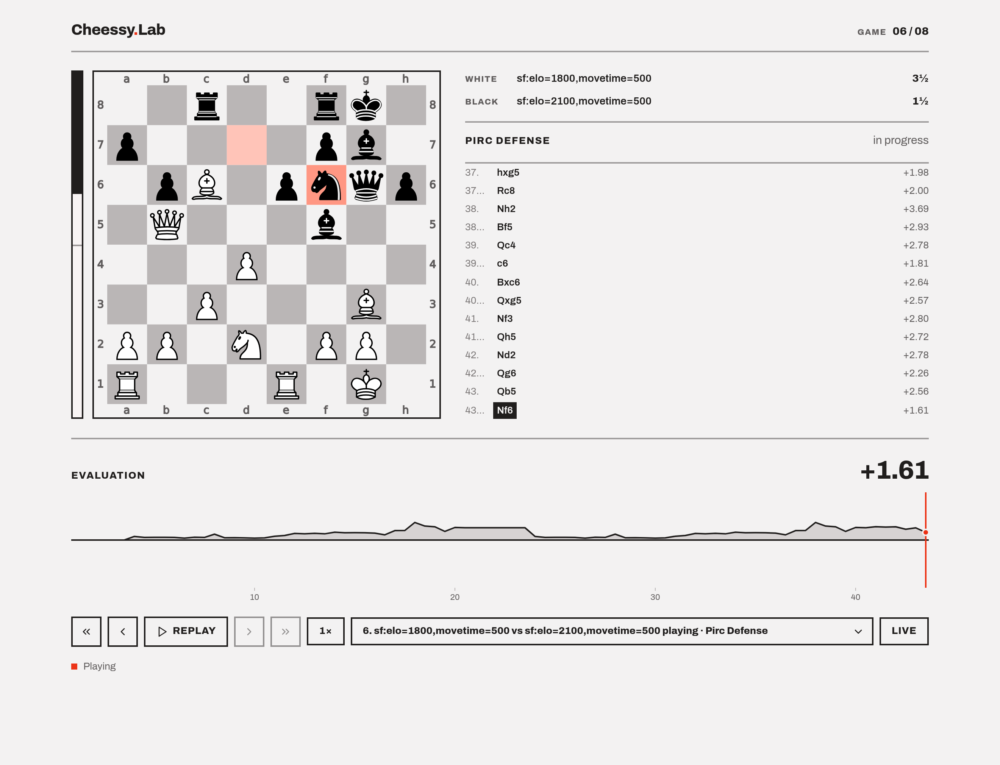
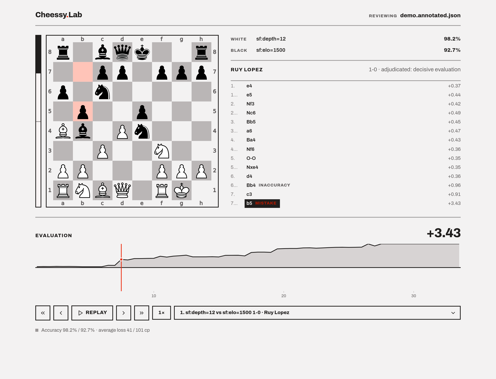
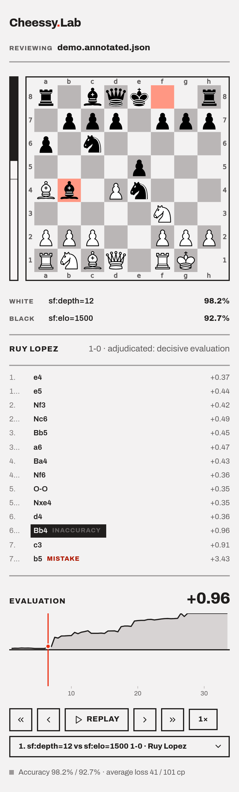

# cheessy

Local chess sparring and game review. Plays engines against each other from a book
of named openings, annotates the games at depth, and serves both live play and
finished analysis in the browser.

No account, no opponent, no platform — a few hundred study-able games an hour
instead of one per ten minutes.



<sub>Live play, then browsing back to an earlier game and replaying it at 2x.
Full quality: [docs/demo.mp4](docs/demo.mp4)</sub>

## Quick start

```bash
sudo pacman -S stockfish          # the engine (Stockfish 18)
cd lab && uv venv && uv pip install -e .

# play 8 games at a watchable pace and follow them in the browser
.venv/bin/cheessy watch --white "sf:elo=2100,movetime=500" \
                        --black "sf:elo=1800,movetime=500" -n 8

# analyse them, then step through with classifications
.venv/bin/cheessy review games/watch.pgn --depth 18
.venv/bin/cheessy show   games/watch.annotated.pgn
```

Every game in a run stays browsable after it ends — pick any from the dropdown,
step it with the arrow keys, or press **Replay** to play it back at 1×/2×/4×.

## Live

Board, evaluation meter, the evaluation graph of the whole game, the running
match score, and the move list. While a run is going the viewer follows the game
in play; navigating away stops it following, and **Live** jumps back.



## Review

The same panel over an analysed run, plus what the review pass computed: per-move
classifications, accuracy, and average centipawn loss.



## What's in here

| | |
| --- | --- |
| `lab/` | the tool — see [lab/README.md](lab/README.md) |
| everything else at the root | a Manifest V3 chess.com extension, abandoned in 2025 and non-functional. Kept for reference; see [CLAUDE.md](CLAUDE.md) for why it's dead. |

## Design

The viewers follow the **Modernist** design system: flat and architectural,
Archivo, zero corner radius, 2px rules, flush-left labels. The board wears the
system's neutral ramp rather than the usual browns — and since the piece set is
already pure black and white, the whole plate lands monochrome, which frees the
single red accent to mean something: the last move, the current ply, and blunders.

The evaluation graph is a value-diverging area over plies — pale above the zero
rule where White leads, ink below where Black leads. The board's own logic rather
than an arbitrary pair of hues.

<p align="center"></p>
